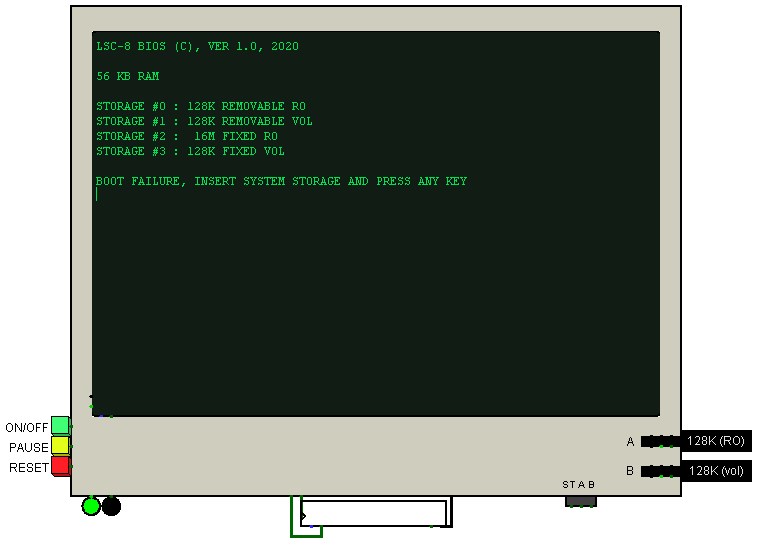
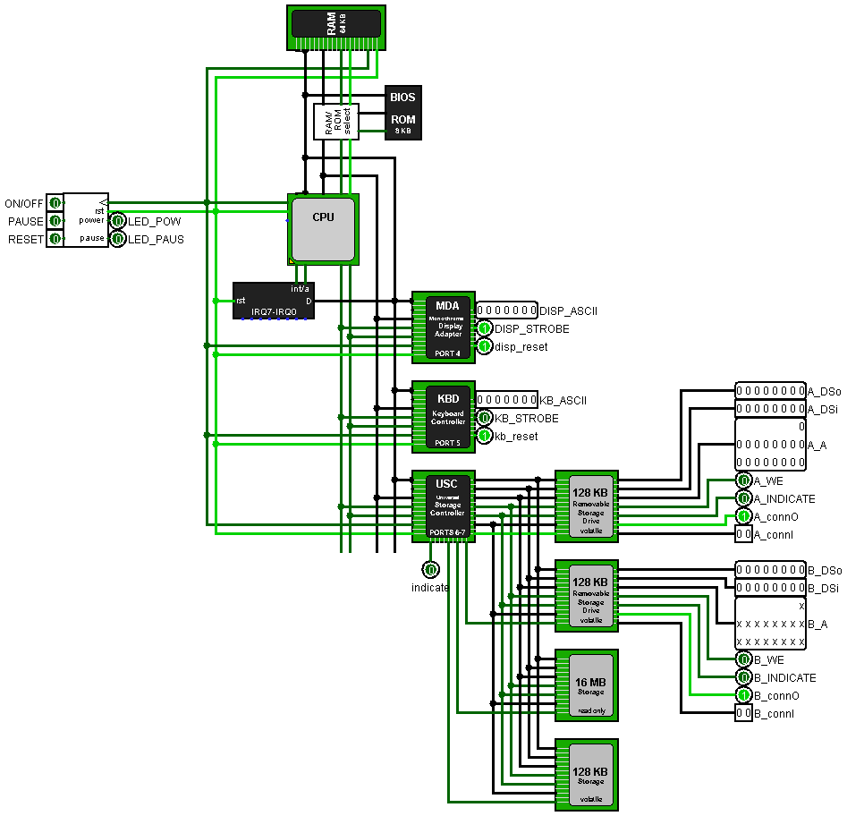
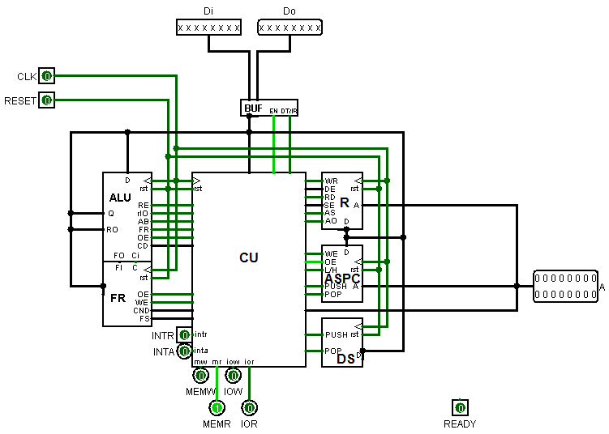
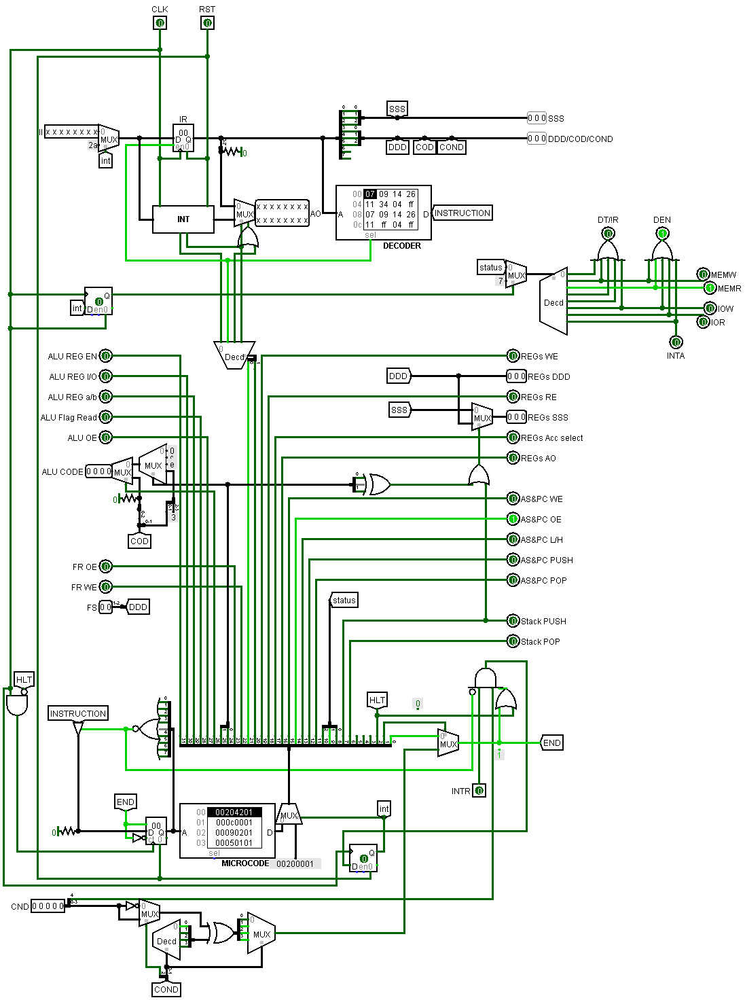
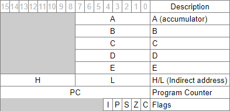
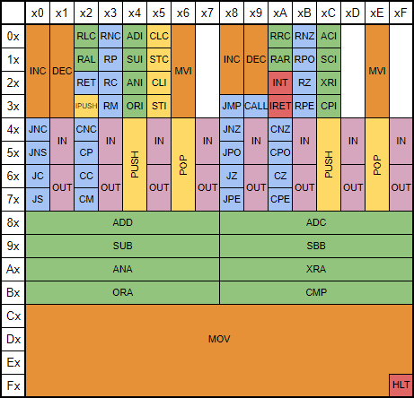

# LogiSim Computer with 8-bit CPU

[](https://github.com/baskiton/lsc-8/blob/main/LICENSE)

The computer is designed and built in the Logisim program. You can download it from the [official website](http://www.cburch.com/logisim/)

Before starting, be sure to set the maximum frequency of the oscillator (Simulate -> Tick Frequency -> 4.1 KHz).
After running the simulation and the oscillator, select the "hand" tool and click on the green
button near the display (`ON/OFF`) and wait for the result =)

1. [Computer](#1.-Computer)
    1. [Interface](#1.1-Interface)
    2. [Architecture](#1.2-Architecture)
    3. [BIOS](#1.3-BIOS)
        1. [Initialization](#1.3.1-Initialization)
        2. [Vector Table](#1.3.2-Vector-Table)
            * [INT 3h](#INT-3h)
            * [INT 4h](#INT-4h)
            * [INT 5h](#INT-5h)
            * [INT 6h](#INT-6h)
            * [INT 7h](#INT-7h)
2. [CPU](#2.-CPU)
    1. [Description](#2.1-Description)
    2. [Modules](#2.2-Modules)
        1. [Control Unit](#2.2.1-Control-Unit)
        2. [ALU](#2.2.2-ALU)
        3. [Registers](#2.2.3-Registers)
        4. [Flags](#2.2.4-Flags)
    3. [ISA](#2.3-ISA)
3. [Programming](#Programming)

## 1. Computer
### 1.1 Interface
The interface of this computer in Logisim looks like this:



##### Display 80x25 monochrome symbolic
##### Buttons:
* `ON/OFF` Turn on/off computer
* `PAUSE` Suspend the computer
* `RESET` Restart computer
##### LED indication is located next to the buttons:
* `LEFT` (green) - indicates the computer is on
* `RIGHT` (yellow) - indicates the computer is suspend (pause)
##### The keyboard is located directly below the display.
##### To the right of the display are the ports for removable drives (`A` and `B`).
##### Nearby is the indication of access to drives (`ST A B`):
* `ST` Common indicator of work with drives (both external and internal)
* `A` Indicator of work with A-drive
* `B` Indicator of work with B-drive

### 1.2 Architecture



#### The computer has a classic architecture:
* `CPU` - 8-bit CISC with RISC core
* `Clock & State generator` 
* `RAM` - 56 kB
* `BIOS ROM` - 8 kB
* `Interrupt Controller` - 8 lines
* `Other controllers` - 16 in/out ports
#### Controllers:
#### `MDA` - Monocrome Display Adapter (`Port 4`)
The simplest controller for displaying characters.
* Uses `port 4` for writing
* Reading from this port is always 0
#### `KBD` - Keyboard Controller (`Port 5`)
The keyboard controller uses `port 5`:
* Read: read from the keyboard buffer
* Write: `0x0C`: clear buffer
* Write: `0x11`: reading from the buffer without removing the character
#### `USC` - Universal Storage Controller (`Port 6` / `Port 7`)
Provide 256 bytes per sector. Max sector number 65535 (16 MB). Max 4 device support.
##### Sequence of requests:
###### `Port 7`:
* Read: reading parameter of storage device (size, fix/rem, mode... see below)
* Write: bxxxxx1xx (bit 2) - reset controller setup
* Write: bxxxxxxNN (0-1 bits) - select drive number (0-3)
###### `Port 6`:
* Write (after select): set HIGH sector number
* Write (next): set LOW sector number
* Write (after setup): write data to storage
* Read (after setup): read data from storage
##### Storage parameter
* 0-2 bits: Size (0 - no storage; 1 - 128 KB; 512K; 1M; 2M; 4M; 8M; 7 - 16 MB).
Maximum size of removable storage is 128 KB
* 3 bit: 0 - read only; 1 - volatile
* 4 bit: 0 - fixed; 1 - removable
* 5 bit: reserved
* 6 bit: 1 - storage is available
* 7 bit: 1 - controller of storage is set up

### 1.3 BIOS
Basic Input/Output System

#### 1.3.1 Initialization
In this computer, the maximum BIOS size is 8 KB. Its data area starts at `0xE000`. After turning on the computer, the processor goes to this address and starts executing instructions from the initialization process:
1. Test of registers
2. Memory test (read/write). Here the size of the RAM is determined, the value is written into a special data segment in the RAM
3. The interrupt vector table is written at address `0x0000`. Currently 8 vectors are valid (see their description below)
4. Then the screen is cleared and an information message is printed
5. Storage system initialization. The presence of drives in the ports and their parameters are determined here
6. After successful initialization of at least one drive, an attempt is made to boot from it, otherwise an error message is displayed
7. The first sector (256 bytes) is read from the first available drive into RAM at address `0x0C00`. The last byte of the sector is checked for a signature value of `0xAB`. If there is a mismatch, an attempt is made to read the first sector from the next available drive.
8. If the signature matches, control of the computer is transferred to the loaded code.

#### 1.3.2 Vector Table
|Vector|Name|Description|
|------|----|-----------|
|0-2|Reserved|Reserved for future use|
|3|BOOT_STRAP|Boot Strap Loader|
|4|VIDEO_IO|Video I/O - provide the TTY interface|
|5|KEYBOARD_IO|Keyboard I/O|
|6|MEMORY_SIZE|Get memory syze in KB|
|7|STORAGE_IO|Storage I/O|

The following is a detailed description of interrupts. Some of them take parameters and return results using general registers (`A`, `B`, `C`, `D`, `E`, `H`, `L`)

##### `INT 3h`
Boot Strap Loader. Sector 0 read into the Boot Location (`0x0C00`). Control is transferred there after check the last byte of sector is `0xAB`.

##### `INT 4h`
These routines provide the `TTY` interface:

INPUT:
* (`A`)=0   Clear screen
* (`A`)=1   Write Character at current cursor position
    * (`B`) Char to write
    * (`C`) Count of Characters to write
* (`A`)=2   Convert and Write a number to ASCII
    * (`B`) Number to ASCII
* (`A`)=3   Write String at current cursor position
    * (`B`)=0   Write String by known length
        * (`C`) Length of String
    * (`B`)=1   Write a String with a `$` char at the end
    * (`H`)(`L`) Address of String

##### `INT 5h`
Keyboard I/O

INPUT:
* (`A`)=0 Read the next ASCII char struk from the keyboard wihout echo.
* (`A`)=1 Read the next ASCII char struk from the keyboard with echo.
    * Wait input if buffer is empty.
    * Return result in (`A`)
* (`A`)=2 Set the `Z` Flag to indicate if an ASCII char is available to be read without echo.
    * (`ZF`)=1 - No code available.
    * (`ZF`)=0 - Code is available. Return code to (`A`) with saved buffer state.
* (`A`)=3 Read the keyboard String and store to the buffer without echo.
* (`A`)=4 Read the keyboard String and store to the buffer with echo.
    * (`H`)(`L`) - Address of buffer in the RAM.
    * initial buffer:
        ```
        +---+---+---+---+---+---+- - -
        ¦max¦ ? ¦ ?   ?   ?   ?   ?
        +---+---+---+---+---+---+- - -
        ```
    * buffer out:
        ```
        +---+---+---+---+---+---+- - -
        ¦max¦len¦ T   E   X   T   0Ah
        +---+---+---+---+---+---+- - -
        ```
       * `max` - max buffer length
       * `len` - actual buffer length without trailing CR (`0Ah`)
* (`A`)=12(0Ch) Clear buffer before input and call function from (`B`)
    * (`B`) - Number of function to call

OUTPUT:
* As noted above, only (`A`) and `Flags` changed. All registers preserved.

##### `INT 6h`
Return memory syze in KB to register (`A`)

##### `INT 7h`
Storage I/O. Storage Controller has 256 bytes per sector.

INPUT:
* (`A`)=0   Reset Storage System
* (`A`)=1   Verify Storage
* (`A`)=2   Read Storage
* (`A`)=3   Write Storage

For Read/Write/Verif:
* (`B`) - Drive Number (0-3 allowed, value checked)
* (`C`) - Number of Sectors
* (`D`) - High Sector Number
* (`E`) - Low Sector Number
* (`H`)(`L`)  Address of Buffer (Not required for verify)

OUTPUT:
* (`A`) - Return params from VERIFY

## 2. CPU



### 2.1 Description
The CPU is implemented with a CISC instruction set, but with a RISC core. This is the simplest 8-bit processor, no pipeline, no scalarity, no parallelism, built on the von Neumann architecture, but with some differences (see below).

* Data width:       8 bit
* Address width:    16 bit
* I/O ports number: 16
* Interrupts:       up to 256 (software and external)
* ISA:              own

#### Differences from von Neumann architecture:
Stack space is separated from `RAM` and resides directly on the CPU. The stack is divided into two independent areas: the `data stack` and the `address stack`. Access is possible **only** to the `data stack` and only with `push` and `pop` instructions. The `address stack` is used by the processor to store return addresses when calling functions/subroutines/interrupts. The `data stack` is 8 bits wide and the `address stack` 16 bits wide. Both stacks have a depth 256.

### 2.2 Modules:
* `CU` Control Unit
* `ALU` Arithmetic Logic Unit
* `FR` Flag Registers
* `BUF` Data Bus Buffer
* `R` Registers Scratch Pad
* `ASPC` Address Stack & Program Counter
* `DS` Data Stack

#### 2.2.1 Control Unit



The Сontrol Unit is designed to generate control signals for all processor units and is a state machine. It consists of an Instruction Register, a Command Decoder, a Program Counter, and a signal generation unit.

When executing the program, the CU receives the next instruction at the input, which enters the instruction register. Each instruction consists of a certain set of components, among which the operation code is mandatory. Next, the instruction decoder decodes the code and executes the corresponding microprogram from microcode. Each firmware terminates with an `END` signal (except for the HLT (halt) instruction), which allows the CU to begin receiving the next instruction (Fetch microcommand). Each microinstruction is atomic. Thus, can say that it is a RISC core.

The decoder code is written in ROM. View it is possible [here](https://docs.google.com/spreadsheets/d/1ht68J6B6FNXPJV-Rl-5vgTjGJbA4mdbe5pMpLTFEx3M/edit#gid=1843187321) (Google Tables).

The microcode is stored in a separate ROM. Watch [here](https://docs.google.com/spreadsheets/d/1ht68J6B6FNXPJV-Rl-5vgTjGJbA4mdbe5pMpLTFEx3M/edit#gid=1418222222) (Google Tables).

#### 2.2.2 ALU
The following arithmetic-logical operations are supported:
* Arithmetic addition and subtraction
* Logical AND, OR, XOR
* Bit shifts and rotations

Also different ALU operations generate different flags:
* `CF` - Carry Flag
* `ZF` - Zero Flag
* `SF` - Sign Flag
* `PF` - Parity Flag

#### 2.2.3 Registers



Base registers (`A`, `B`, `C`, `D`, `E`, `H`, `L`) are 8-bit and available for use.

Register `A` is an accumulator - it stores the results of arithmetic and logical operations.

The `H` and `L` registers are used together as a memory address (`H` - high address byte, `L` - low address byte).

PC is an internal 16-bit register and cannot be accessed. Internal registers also include IR (instruction register) and stack pointers, they are not listed in the table.

To flag register are not directly accessible, but there is a special processor instructions, with which can change some flags.

#### 2.2.4 Flags
The flags indicate the current state of the processor or the result of some operations, and may also affect other operations.
* `C` - Carry Flag
* `Z` - Zero Flag
* `S` - Sign Flag
* `P` - Parity Flag
* `I` - Interrupt enable flag

### 2.3 ISA



The table above shows the instruction set (ISA) for this processor. The MSC-8 (ISA for intel 8008) is taken as a basis (like the processor itself), but with improvements and modifications for my tasks. A more detailed description of the ISA can be found [here](https://docs.google.com/spreadsheets/d/1ht68J6B6FNXPJV-Rl-5vgTjGJbA4mdbe5pMpLTFEx3M/edit#gid=0) (Google Tables).

### Programming
This computer can be programmed. You can run your programs in two ways:
1. Write the program code to BIOS ROM
2. Write the program code to one of the drives (internal or external)

Programs are written in assembler with intel-syntax. Next, the code is translated into bytecode using the translator included in the utility package (`tools/lsc-8.py`). To run the translator, you need `Python 3.7` or higher (can download it from the [official website](https://www.python.org)).

**Please note** that the assembler is quiet stripped down, it lacks many directives, or they may not work as you expect.

An example of a small program recorded on removable media that displays "Hello, World":
```
org 0C00h   ; start address of boot record
jmp start

msg:
    db 'Hello, World', 0Ah

start:
    mov a, 3    ; write string
    mov b, 0    ; by lenght
    mov c, (start - msg)    ; len
    mov h, (msg >> 8)       ; string high address
    mov l, (msg & 255)      ; string low address
    int 4h      ; video interrupt
    hlt         ; halt system

db 226 dup 0    ; pad
db 0ABh         ; boot signature
```
You can find other examples (including the BIOS source code) in the `src` directory.

To translate the assembly code into bytecode, it is enough to perform the following operation on the command line:
```
python tools/lsc8-asm.py src/hello-world.asm -o rom/hw.rom
```
Next, the resulting rom file must be downloaded to the device in Logisim:
1. Find the target device (drive or ROM BIOS) and enter it
2. Select the ROM module, in the attributes panel, click on the field opposite the Content line `(click to edit)`
3. In the window that appears, click `Open`, select and open your rom file, and click `Close Window`
4. Done. Start/restart computer
